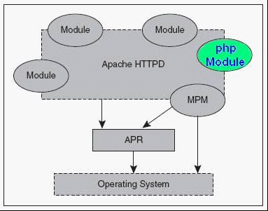
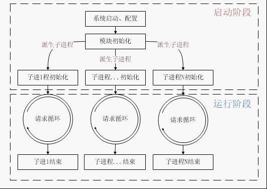
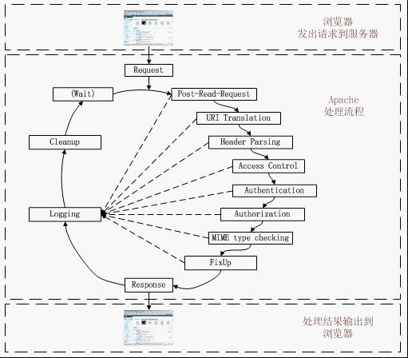
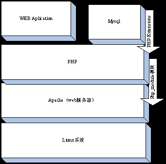
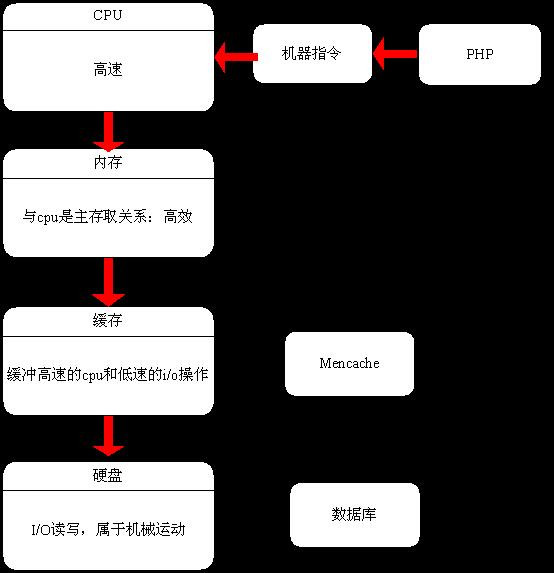

# PHP的基本工作原理 #
## 1）：PHP和Apache的关系 ##
Apache对于php的解析，就是通过众多Module中的php Module来完成的 

 把php最终集成到Apache系统中，还需要对Apache进行一些必要的设置。这里，我们就以php的mod_php5 SAPI运行模式为例进行讲解，至于SAPI这个概念后面我们还会详细讲解。 

假定我们安装的版本是Apache2 和 Php5，那么需要编辑Apache的主配置文件http.conf，在其中加入下面的几行内容：

	Unix/Linux环境下：

	LoadModule php5_module modules/mod_php5.so
	
	AddType application/x-httpd-php .php

注：其中modules/mod_php5.so 是X系统环境下mod_php5.so文件的安装位置。

	Windows环境下：

	LoadModule php5_module d:/php/php5apache2.dll
	
	AddType application/x-httpd-php .php

注：其中d:/php/php5apache2.dll 是在Windows环境下php5apache2.dll文件的安装位置。 

这两项配置就是告诉Apache Server，以后收到的Url用户请求，凡是以php作为后缀，就需要调用php5_module模块（mod_php5.so/ php5apache2.dll）进行处理。

## 2）：Apache的生命周期 ##

##  3）：Apache的请求处理流程 ##

Apache请求处理循环的11个阶段都做了哪些事情呢？
### 1、Post-Read-Request阶段 ###

在正常请求处理流程中，这是模块可以插入钩子的第一个阶段。对于那些想很早进入处理请求的模块来说，这个阶段可以被利用。

### 2、URI Translation阶段 ###
Apache在本阶段的主要工作：将请求的URL映射到本地文件系统。模块可以在这阶段插入钩子，执行自己的映射逻辑。mod_alias就是利用这个阶段工作的。

### 3、Header Parsing阶段 ### 
Apache在本阶段的主要工作：检查请求的头部。由于模块可以在请求处理流程的任何一个点上执行检查请求头部的任务，因此这个钩子很少被使用。mod_setenvif就是利用这个阶段工作的。

### 4、Access Control阶段 ### 
Apache在本阶段的主要工作：根据配置文件检查是否允许访问请求的资源。Apache的标准逻辑实现了允许和拒绝指令。mod_authz_host就是利用这个阶段工作的。

### 5、Authentication阶段 ### 
Apache在本阶段的主要工作：按照配置文件设定的策略对用户进行认证，并设定用户名区域。模块可以在这阶段插入钩子，实现一个认证方法。

### 6、Authorization阶段  ###
Apache在本阶段的主要工作：根据配置文件检查是否允许认证过的用户执行请求的操作。模块可以在这阶段插入钩子，实现一个用户权限管理的方法。

### 7、MIME Type Checking阶段  ###
Apache在本阶段的主要工作：根据请求资源的MIME类型的相关规则，判定将要使用的内容处理函数。标准模块mod_negotiation和mod_mime实现了这个钩子。

### 8、FixUp阶段 ### 
这是一个通用的阶段，允许模块在内容生成器之前，运行任何必要的处理流程。和Post_Read_Request类似，这是一个能够捕获任何信息的钩子，也是最常使用的钩子。

### 9、Response阶段 ### 
Apache在本阶段的主要工作：生成返回客户端的内容，负责给客户端发送一个恰当的回复。这个阶段是整个处理流程的核心部分。

### 10、Logging阶段  ###
Apache在本阶段的主要工作：在回复已经发送给客户端之后记录事务。模块可能修改或者替换Apache的标准日志记录。

### 11、CleanUp阶段 ### 
Apache在本阶段的主要工作：清理本次请求事务处理完成之后遗留的环境，比如文件、目录的处理或者Socket的关闭等等，这是Apache一次请求处理的最后一个阶段。

## 4）：LAMP架构 ##

从下往上四层：

	①liunx 属于操作系统的底层
	
	②apache服务器，属于次服务器，沟通linux和PHP
	
	③php:属于服务端编程语言，通过php_module 模块 和apache关联
	
	④mysql和其他web服务：属于应用服务，通过PHP的Extensions外 挂模块和mysql关联

## lamp和电脑内部的关系 ##

CPU是工厂，硬盘是大仓库，内存是正规中转中心，虚拟内存是临时中转中心.  

Php语言由zend编译成机器语言，操作cpu  

对数据库的操作属于I/O操作，属于机械运动，也就是说一个网站的瓶颈再去对硬盘的读写造成的，解决办法就是减少i/o操作次数，使用缓冲技术，就是在数据的操作放在mencache里面，达到一定数量级的时候在一次性写入数据库，mencache属于key--value关系  

而非关系型数据也是基于这个理念建设的，也是属于key--value关系  

频繁读操作------放在mencache里面  

读多写少----放在nosql里面------读取功能很强大！  