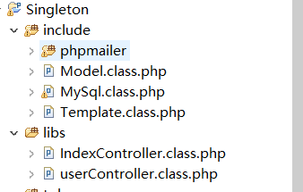

# 邮件发送类配置 #
开启网易邮箱SMTP服务  

进入到pop3/smtp设置页面  

开启服务，填写验证，手机号接收设置的授权码。  

目录结构  

代码如下：

	require_once 'include/phpmailer/class.phpmailer.php';
    require_once 'include/phpmailer/class.smtp.php';
    $email=new PHPMailer();
    $email->isSMTP();
    $body="欢迎注册吃了么";
    $email->CharSet='utf-8';
    $email->Port=25;
    $email->SMTPAuth=true;
    $email->SMTPKeepAlive=true;
    $email->Host="smtp.163.com";
    $email->Username='17092559941@163.com';
    $email->Password='18796005530mgm';
    $email->From='17092559941@163.com';
    $email->FromName='guomin';
    $email->Subject='guomin发来一封邮件';
    $email->AltBody=$body;
    $email->WordWrap=50;
    $email->msgHTML($body);
    $email->addReplyTo('17092559941@163.com','guomin');
    $email->addAddress('424239968@qq.com','hello');
    $email->isHTML(true);
    if (!$email->send()){
        echo '发送失败'.$email->ErrorInfo;
    }else {
        echo "发送成功";
    }

发送成功后输出“发送成功” 此时qq邮箱：  

